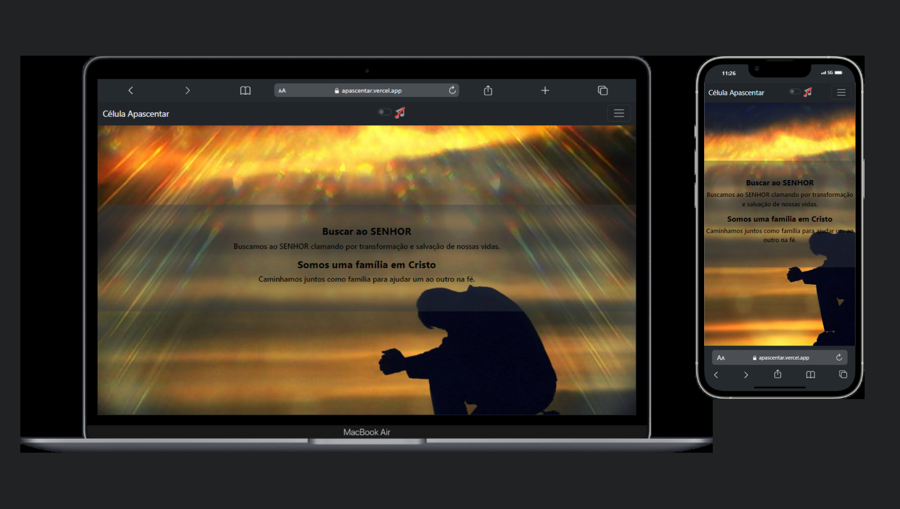

<h1 align="center"> APASCENTAR </h1>

 Somos um grupo de pessoas que buscamos ao SENHOR Jesus. 
 <a href="https://apascentar.vercel.app/">Clique e veja a versão publicada.</a>

 <a href="#-tecnologias">Tecnologias</a>   |   
 <a href="#-projeto">Projeto</a>   |   
 <a href="#-layout">Layout</a>

 

 

# # 🚀 Tecnologias

Esse projeto foi desenvolvido com as seguintes tecnologias :

#### -HTML e CSS
#### -JavaScript
#### -Bootstrap
#### -Git e Github
#### -Vercel

# # 💻 Projeto

O "APASCENTAR" foi desenvolvido para prática de desenvolvimento do Bootstrap.

# # 🔖 Layout

Layout desenvolvido para todos dispositivos.
